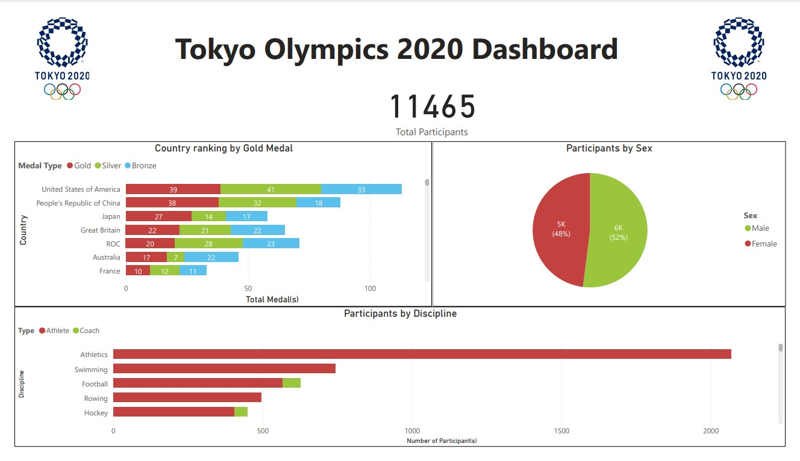
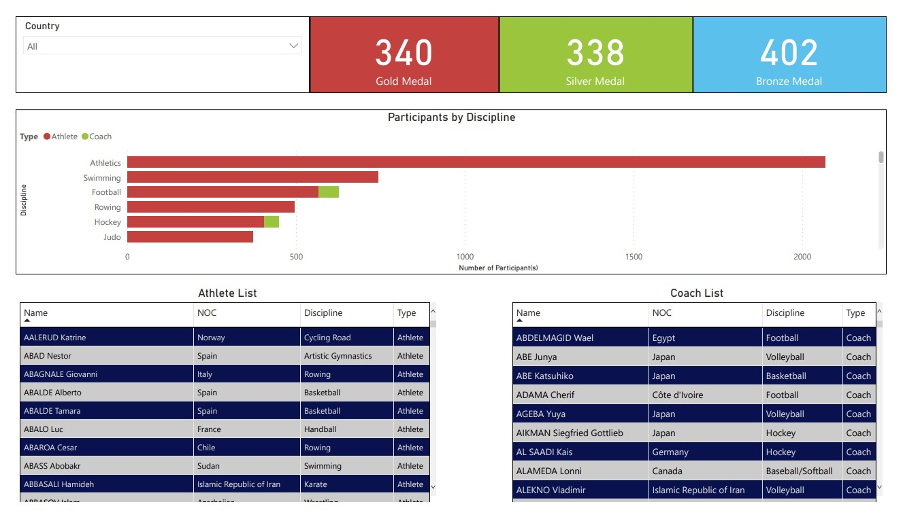

# Tokyo Olympics 2020 Dashboard
## Overview
This dataset contains the details of over 11,000 athletes, with 47 disciplines, along with 743 Teams taking part in the 2021(2020) Tokyo Olympics. 
This dataset contains the details of the Athletes, Coaches, Teams participating as well as the Entries by gender. It contains their names, countries represented, discipline, gender of competitors, name of the coaches.

## Data Source
Big kudos to [Arjun Prasad Sarkhel
](https://www.kaggle.com/arjunprasadsarkhel), for this [2021 Olympics in Tokyo](https://www.kaggle.com/datasets/arjunprasadsarkhel/2021-olympics-in-tokyo) dataset.  This dataset will also be included within this project folder.

## Problem Statement
From this dataset, we want to know the following information:
* NOC/Country that won the most medals
* Discipline with the most participants
* Medals won by each NOC/Country
* Discipline participation by NOC/Country
* Attendants (Athlete + Coach) list by NOC/Country

## Data Exploration in SQL
```SQL

-- REVIEW ENTIRE DATASET
SELECT TOP (50) * FROM Portfolio..Athletes;

SELECT TOP (50) * FROM Portfolio..Coaches;

SELECT TOP (50) * FROM Portfolio..EntriesGender;

SELECT TOP (50) * FROM Portfolio..Medals;

SELECT TOP (50) * FROM Portfolio..Teams;

-- DATA EXPLORATION

-- Seeing the amount of athletes from each Country/NOC
SELECT NOC, COUNT(*) AS Total FROM Portfolio..Athletes GROUP BY NOC ORDER BY Total DESC;

-- Seeing the amount of coaches from each Country/NOC
SELECT NOC, COUNT(*) AS Total FROM Portfolio..Coaches GROUP BY NOC ORDER BY Total DESC;

-- Seeing the total amount of medals
SELECT SUM(CAST(Total AS int)) AS TotalMedals FROM Portfolio..Medals;

-- Seeing the total amount of attendants
SELECT SUM(CAST(Total AS int)) AS TotalAthletes FROM Portfolio..EntriesGender;

-- Checking for Cambodia attendants
SELECT * FROM (
	SELECT *, 'Athlete' AS Type FROM Portfolio..Athletes
	UNION
	SELECT Name, NOC, Discipline, 'Coach' AS Type FROM Portfolio..Coaches
) AS CamboCheck WHERE NOC = 'Cambodia';

-- Medals win percentage by team
SELECT 
	"Team/NOC" AS NOC, Gold, Silver, Bronze,  
	CAST(Total AS Int) * 100.0 / SUM(CAST(Total AS INT)) OVER () AS MedalPercentage
FROM Portfolio..Medals ORDER BY MedalPercentage DESC;

-- DATA EXPORT FOR VISUALIZATION
-- For AttendantsQuery.csv
SELECT *, 'Athlete' AS Type FROM Portfolio..Athletes
	UNION
SELECT Name, NOC, Discipline, 'Coach' AS Type FROM Portfolio..Coaches;

-- For GenderQuery.csv
SELECT Discipline, Female, Male FROM Portfolio..EntriesGender;

-- For MedalsQuery.csv
SELECT "Team/NOC" AS NOC, Gold, Silver, Bronze FROM Portfolio..Medals;

```

## Data Modeling and Visualization in Power BI
* GenderQuery Table: Unpivot Female and Male columns
* MedalsQuery Table: Unpivot Gold, Silver and Bronze columns

## End Result


