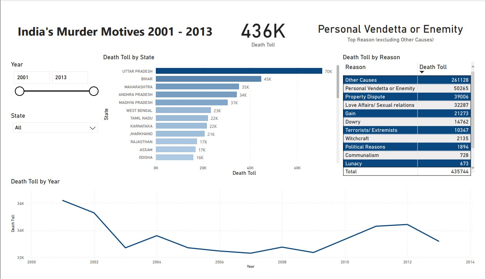

# Motives of Murder in India from 2001 to 2013
## Overview
This dataset provides a comprehensive analysis of murder motives in India, state by state, from 2001 to 2013. The data provides insight into the dark side of Indian society, delving into the reasons behind some of the most heinous crimes committed in the country.

## Data Source
Big kudos to [Paramamithra](https://www.kaggle.com/paramamithra), for this [Motives of Murder in India from 2001 to 2013](https://www.kaggle.com/datasets/paramamithra/motives-of-murder-in-india-from-2001-to-2013) dataset.  This dataset will also be included within this project folder.

## Problem Statement
From this dataset, we want to know the following information:
* Which state has the highest murder count
* Which motive is behind the most murder
* The murder rate over the period

## Data Wrangling
In order to create proper dashboard for our data, we need to first wrangle it:
* There's some inconsistent data in the STATE field for YEAR 2013, we need to directly modify our data:
  * Delhi UT > Delhi
  * D&N Haveli > D & N Haveli
  * A&N Islands > A & N Islands
* Remove Total Column: Power Query > Home > Remove Columns
* Since 2013 CITY names are also different from others, we need to also uppercase them with: Power Query > Transform > Format > UPPERCASE
* Filter Total Rows: Power Query > Click on right drop down within the **STATE** header > Text Filter > Does Not Contain > **TOTAL**
* Unpivot Columns: Power Query > Select **STATE** and **YEAR** columns > Right Click > Unpivot Other Columns
* Rename unpivoted columns: Power Query > Double Click on the unpivoted columns respectively

## End Result

