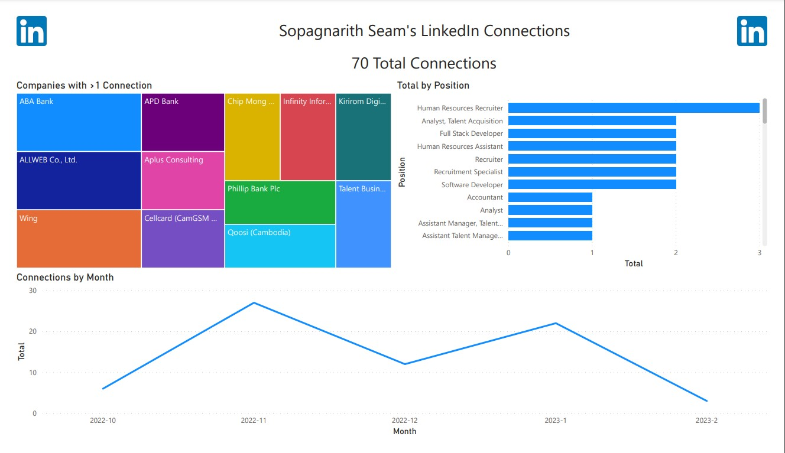

# LinkedIn Data
## Inpsiration
This project was mainly inspired by [Chris French](https://www.linkedin.com/in/chris-french-data/). Please refer to this [LinkedIn post](https://www.linkedin.com/posts/chris-french-data_tableau-connections-dataanalyst-activity-7025447535703912448-0_j6/) for further guidance.

## Overview
In LinkedIn, you can request to download data related to you such as: Articles, Connections, Messages, Invitations, Profile...etc. For this project, we will be taking a look at my personal Connections data, which I will also include along with this project.

## Data Cleaning
Since the data is not fully cleaned for the machine to fully interpret it, we need to first clean it. We will be using Power BI's Power Query in order to clean the dataset:
* Remove top rows: Home > Remove Rows > Remove Top Rows (3)
* Promote first row as headers: Home > Use First Row as Headers
* Change date to proper format: Click on the icon within the **Connected On** header > Select Date
* Remove email column: Home > Select **Email Address** column > Remove Columns
* Remove row with empty values: Click on right drop down within the **Company** header > Remove Empty

## End Result

