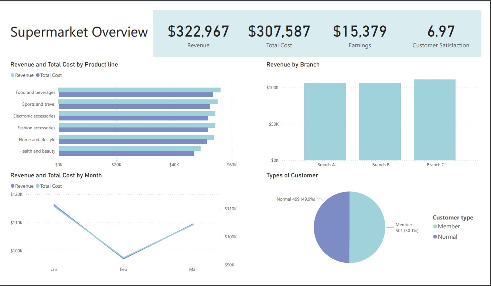

# Supermarket Sales

## Dataset Source
Big kudos to [Aung Pyae](https://www.kaggle.com/aungpyaeap) for this [Supermarket sales](https://www.kaggle.com/datasets/aungpyaeap/supermarket-sales) dataset.

## Overview
A sales dashboard usually helps company to keep track of their performance and various KPI. In this dashboard, we will be exploring various KPIs such as:
* Revenue by month, branch, product line, customer type
* Total cost by month, branch, product line, customer type
* Earnings by month, branch, product line, customer type
* Customer satisfaction by month, branch, product line, customer type
* Types of customer by month, branch, product line

## Result

